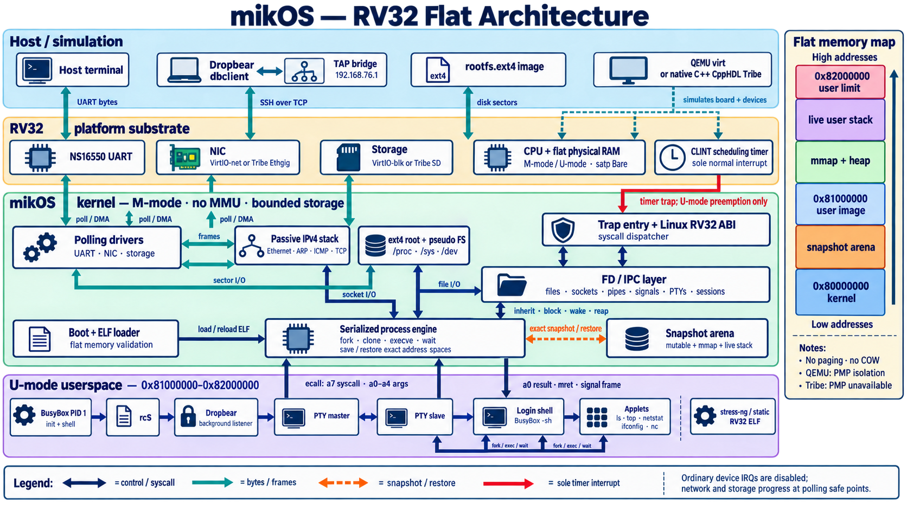

# mikOS

Lightweight C++ replacement for Linux without MMU/TLB, exceptions and interrupts to fit in 512kB.

Mikos is an experimental, test-driven operating system with a minimal
mechanism-only kernel, flat-memory architecture profiles, polling instead of
ordinary device interrupts, and generated Linux syscall ABI tables.



Start with:

- [Requirements](REQUIREMENTS.md)
- [Development plan](PLAN.md)
- [Kernel C++ containers and size budget](doc/kernel-cxx.md)
- [Kernel/driver C++ cleanup and ABI boundaries](doc/cxx-modernization.md)
- [RV32 BusyBox proof of concept](doc/poc-rv32.md)
- [Polling network proof of concept](doc/network-poc.md)
- [Regression and acceptance tests](tests/README.md)

The current proof of concept boots on the supplied RV32 QEMU, enters a
PMP-protected flat U-mode region, mounts an ext4 root image, and loads static
BusyBox and stress-ng ELFs from `/bin` in sequence. BusyBox prints
`MIKOS_BUSYBOX_OK`; stress-ng then runs a
verified four-operation `cpu/loop` workload and reports its own metrics and
success. A sole CLINT scheduling timer also demonstrably preempts an
unmodified, non-cooperative U-mode loop before starting BusyBox; the PLIC and
all device interrupts remain disabled. See
[the stress-ng integration](doc/stress-ng.md) for the exact supported scope.

The first networking slice discovers QEMU's modern virtio-net device over
virtio-mmio, uses polling-only split queues, assigns the fixed POC address
`10.0.2.15`, and passes an end-to-end ARP reply test. This transport is kept
behind a small shared NIC interface so the x86 PCI transport can reuse the
Ethernet/IP code. SSH and `top` are not supported yet; their explicit gates are
listed in the network POC document.

## Build and test

Create the local Conda environment and set `RISCV_HOME` to your RISC-V
toolchain installation (defaults to `~/riscv`):

```sh
conda create -p ./.conda
conda env update -p ./.conda --file requirements.yaml
export RISCV_HOME="$HOME/riscv"
export PATH="$PWD/.conda/bin:$PATH"
make test
make kernel
```

`make` runs the regressions and builds `build/mikos-rv32.elf`. Clang compiles
the kernel; the cross-toolchain supplies C headers and GNU binutils. Either
`$RISCV_HOME/bin/riscv32-unknown-linux-gnu-*` (Linux/glibc) or
`$RISCV_HOME/bin/riscv32-unknown-elf-*` (bare-metal/Newlib) works; the build
prefers Linux when both are installed. Override `RISCV_PREFIX` and, if needed,
`RISCV_SYSROOT` for another location or prefix.

The kernel can compile **without a RISC-V Linux toolchain** using the
bare-metal toolchain. To run native regressions without any RISC-V toolchain,
use `make -C tests regression bridge-check kernel-cxx-check`; `make test`
additionally checks freestanding RV32 and IA-32 drivers and needs RV32 headers.

`make image` additionally builds the BusyBox, stress-ng, and Dropbear
acceptance workloads from `tests/busybox/` and packages them as
`build/tests/busybox/rootfs.ext4`. This requires the **RV32 Linux/glibc**
toolchain with static libraries; the bare-metal Newlib toolchain cannot build
these Linux programs. Its default prefix is
`$RISCV_HOME/bin/riscv32-unknown-linux-gnu-`; override `RISCV_LINUX_PREFIX`
when installed elsewhere. Image creation also needs `e2fsprogs` and the
standard host build tools. The first image build downloads BusyBox and
Dropbear; an existing BusyBox checkout can be selected with
`BUSYBOX_REFERENCE=/path/to/busybox`. stress-ng is vendored in this repository.

If `~/riscv/bin` contains only `riscv32-unknown-elf-*`, prepare the userspace
compiler once before starting the interactive shell:

```sh
export RISCV_HOME="$HOME/riscv"
# Existing, populated https://github.com/riscv-collab/riscv-gnu-toolchain checkout:
export RISCV_TOOLCHAIN_SOURCE="$RISCV_HOME/riscv-gnu-toolchain"
make userspace-toolchain
make image
```

The helper builds an RV32IMA/ILP32 glibc compiler and static libraries under
`$RISCV_HOME/linux`, which subsequent builds detect automatically. It uses a
separate build directory, leaves the bare-metal installation in place, and
resumes completed build stages when rerun. `RISCV_USERSPACE_HOME` overrides
the installation directory; `RISCV_TOOLCHAIN_BUILD` overrides the default
`build/toolchains/rv32-linux` build directory. The default preflight reserves
8 GiB free for the build in addition to the source checkout; `JOBS` defaults
to 2. `RISCV_TOOLCHAIN_MIN_FREE_MIB` overrides that conservative space check
when using a smaller separate build filesystem. Intermediate objects are
cleaned after libc installation to reduce peak space use. A build under
`/tmp` can use a separate filesystem, but is lost when that directory is cleared.
Install the host build dependencies listed in the
[GNU toolchain README](https://github.com/riscv-collab/riscv-gnu-toolchain#prerequisites).
The source checkout must include its GCC, binutils, glibc, and Linux-header
submodules. If absent, obtain it with
`git clone --recursive https://github.com/riscv-collab/riscv-gnu-toolchain "$RISCV_TOOLCHAIN_SOURCE"`.

No Linux guest kernel is built or booted. BusyBox and Dropbear use Linux's
userspace ABI, implemented by mikOS, so they still need a compatible C library.
The interactive launcher checks that the compiler can statically link an
RV32/ILP32 glibc program before rebuilding the simulator. Hard-float `ilp32d`
toolchains are unsuitable for the current Tribe profile.

QEMU acceptance runners are under
`tests/qemu/` and remain available through `make qemu-test` and
`make qemu-net-test`.

## Testing with the current cpphdl / tribe_cpu checkout

Attach your working cpphdl source checkout (not its `build/` directory) with
an exported path. The build and test scripts use standard `grep`; ripgrep
(`rg`) is not required.

```sh
export RISCV_HOME="$HOME/riscv"
export CPPHDL_HOME="$HOME/cpphdl"
make tribe-boot-test
make tribe-kernel-test
make tribe-all-tests
```

`CPPHDL_HOME` selects the current `tribe_cpu` sources, including uncommitted
edits. The preparation script uses cpphdl's CMake feature switches and builds
under `build/tests/tribe/cpphdl-local-build`, with separate single-core and
multicore configurations. It does not reset, check out, or patch your cpphdl
working tree. `CPPHDL_TOOLCHAIN` overrides its default compiler environment,
`$CPPHDL_HOME/.conda`; `CPPHDL_BUILD_ROOT` overrides the separate build root.
`CPPHDL_HOME` is required for Tribe testing. The former pinned clone and
local patch stack have been retired; CPU fixes belong in cpphdl itself.
See [the migration notes](tests/tribe/cpphdl-fixes.md) for the changes and tests.

`make tribe-boot-test` runs the kernel's container self-test and checks flat
memory and disabled device interrupts through the polling UART, then stops
before device initialization. It needs no disk, networking, or Linux userspace.

`make tribe-kernel-test` boots mikOS directly on Tribe and verifies its C++
container self-test, flat-memory/interrupt state, polling UART, ARP, and ICMP.
It uses a rootless Ethernet peer and the bare-metal RV32 toolchain: no Linux
kernel, Linux userspace, disk image, or TAP setup is needed. The runner stops
after the ICMP reply, before the userspace root filesystem is needed.

`make tribe-all-tests` runs the host regressions, single-core and multicore
Tribe boot and kernel-network tests, and all existing BusyBox, ping, TCP, process, and SSH
acceptance targets. It retains logs and a summary under
`build/tests/tribe/results/` and returns failure if any test fails or is blocked.
The userspace acceptance tests execute BusyBox/stress-ng/Dropbear **on mikOS**;
they do not boot Linux. Their current rootfs build still needs the RV32
Linux/glibc cross-toolchain described above to build those Linux-ABI programs.

To use the TAP bridge source from
`$CPPHDL_HOME/tribe_cpu/linux/net/ethgig_tap.cpp`, build it here and start the
wrapper in the background from the same terminal:

```sh
make tribe-tap
sudo bash tests/tribe/start_tap.sh --background
```

The wrapper configures `tap-tribe` as `192.168.76.1/24`, installs the guest
neighbor entry, and runs the selected cpphdl bridge on
`/tmp/tribe-ethgig.sock`. It returns once the socket is ready and prints
the log path and a command to stop the background bridge. Run the interactive
launcher without sudo; sudo normally drops exported settings such as
`CPPHDL_HOME`. With `CPPHDL_HOME` set, the launcher uses this bridge without passing
the mikOS-specific command-line options that cpphdl's bridge does not accept.
TAP creation needs host `CAP_NET_ADMIN`; merely having the bridge source does
not grant that permission. `TRIBE_ETH_TAP_SOCKET` and `TRIBE_INTERACTIVE_TAP`
select another socket/interface; preserve these variables when invoking sudo
if overriding the defaults. See [Tribe tests](tests/tribe/README.md) for the
individual test targets and timeout controls.

## author

This software is developed by Mike Reznikov (https://www.linkedin.com/in/mike-reznikov) based on the results of own research.

This work is not subsidized or paid.
